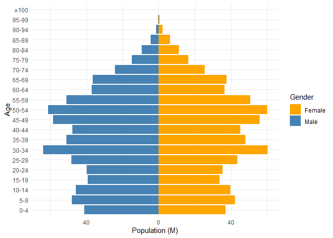
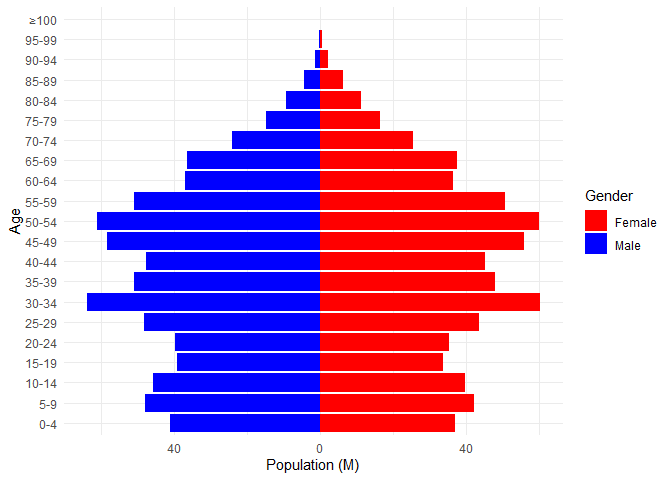

<!-- README.md is generated from README.Rmd. Please edit that file -->

# popdemo

<!-- badges: start -->

<!-- badges: end -->

The goal of popdemo is to provide a minimal example for learning R
package development.

## Installation

You can install the development version of popdemo from
[GitHub](https://github.com/) with:

``` r
remotes::install_github("zhjx19/popdemo")
```

## Example

``` r
library(dplyr)
library(popdemo)
```

Population Structure Data from China’s 7th Census:

``` r
pop7str
#> # A tibble: 21 × 3
#>    Age    Male Female
#>    <chr> <dbl>  <dbl>
#>  1 0-4    41.0   36.9
#>  2 5-9    48.0   42.2
#>  3 10-14  45.6   39.6
#>  4 15-19  39.1   33.6
#>  5 20-24  39.7   35.3
#>  6 25-29  48.2   43.7
#>  7 30-34  63.9   60.3
#>  8 35-39  50.9   48.1
#>  9 40-44  47.6   45.3
#> 10 45-49  58.2   56.0
#> # ℹ 11 more rows
```

Draw a Population Pyramid:

``` r
plot_pyramid(pop7str)      # default colors
```



``` r
plot_pyramid(pop7str, colors = c("blue", "red"))
```



Calculate Dependency Ratio:

``` r
pop7str |> 
  mutate(pop = Male + Female) |> 
  dependency_ratio(Age, pop)
#> [1] 0.4597617
```
